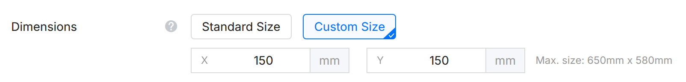
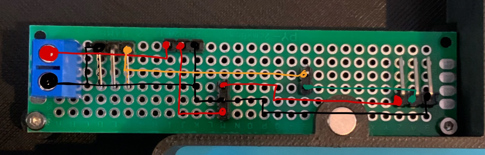
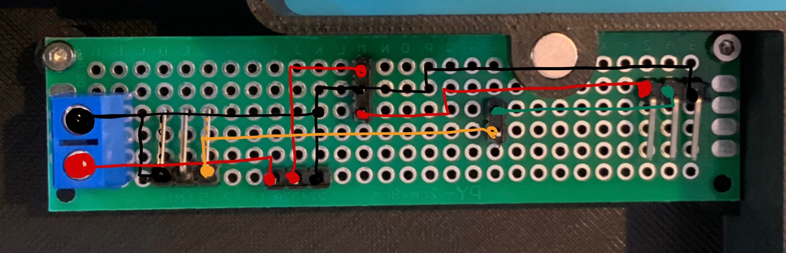

# Stencil Fix Portable

## Stencil size

Use a **150 × 150 mm frameless stencil** with this setup. When ordering from JLCPCB, choose **Framework: No**. Under **Dimensions**, select **Custom Size** and set both **X** and **Y** to **150 mm**.

Choose stencil side and thickness to suit your PCB.

The following settings were confirmed in past JLCPCB stencil orders from 24 April and 16 May 2026:

| JLCPCB order detail | Value |
|---|---|
| Framework | No (frameless) |
| Dimension | 380 × 280 mm (standard size listed in the order) |
| Custom size | **150 × 150 mm** (finished stencil size) |

The order details show both sizes. The **Custom size** value is the one to use for this holder. See [JLCPCB's stencil ordering guide](https://jlcpcb.com/help/article/how-to-order-a-stencil) for its custom-size options.

To find these details in JLCPCB, open **Order History**, filter **Order Type** to **Stencil**, expand the order with **Show All** if needed, and select **Product Details** under **SMT Stencil**.

## Assembly
Perfboard top view

View when soldering (flipped from the top view)

## BOM
| Part | Amount | Comment |
|---|---|---|
| M3\*4*4 heat-set insert | 4 | In base, holding screws for top |
| M2\*3*3.5 heat-set insert | 4 | In base, holding screws for perf board |
| M3*20 socket head screw | 8 | 4 holding top, 4 in lifter |
| M3*12 socket head screw | 4 | Holding motor |
| M2*4 socket head screw | 4 | holding perf board |
| [Spring 9.52\*15.8](https://www.ebay.com.au/itm/155259928566) (US: [3/8"\*3/4"](https://www.harborfreight.com/200-piece-assorted-spring-set-67562.html)) | 4 | 
| 18AWG Wire | 1 | wiring switch, battery and ESC |
| 22AWG Wire | 1 | wiring perf board |
| Perf board 80*20mm | 1 | |
| [QT Py RP2040](https://www.adafruit.com/product/4900) | 1 | |
| [Buck Converter board](https://www.adafruit.com/product/4739) | 1 | |
| [Drone Motor](https://www.phaserfpv.com.au/products/emax-eco-ii-series-2807-motor?variant=37115789213867) | 1 | lower kv == better |
| [Singe ESC](https://www.phaserfpv.com.au/products/aikonak3235a3-6s32bitdshot1200esc) | 1 | Should work with 3 cell LiPo |
| [3 cell LiPo](https://hobbiesdirect.com.au/nVision-11.1v-2200mAh-30C-LiPo-Battery-NVO1810) | 1 | |
| Amass XT60 Connector | 1 | Connecting battery to rocker switch |
| 2.54mm Single Row Male Header | 1 | Get a assortment like [this](https://www.amazon.com.au/dp/B01GY36RJY) |
| 2.54mm Pitch Single Row Right Angle | 1 | |
| Screw terminal 2.54mm pitch | 1 | |
| [Mini Female Spade - Blue](https://www.jaycar.com.au/mini-female-spade-blue-pack-of-8/p/PT4622) | 2 | Connect to the rocker switch |
| [10kΩ Potentiometer B10K](https://www.amazon.com.au/dp/B07XXWWXMC) | 1 | |

## Attribution
The impeller is generated with code from tytouf's [Centrifugal Impleller](https://www.thingiverse.com/thing:259773).
